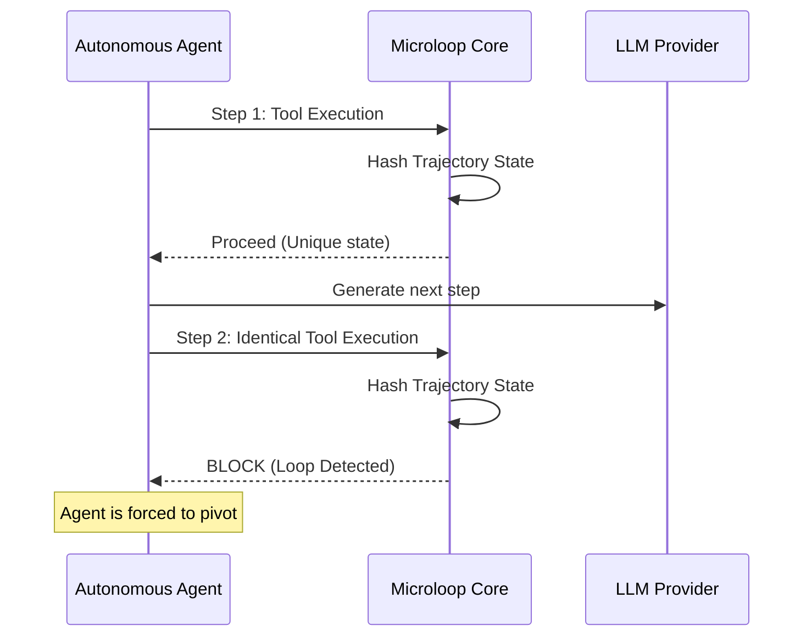
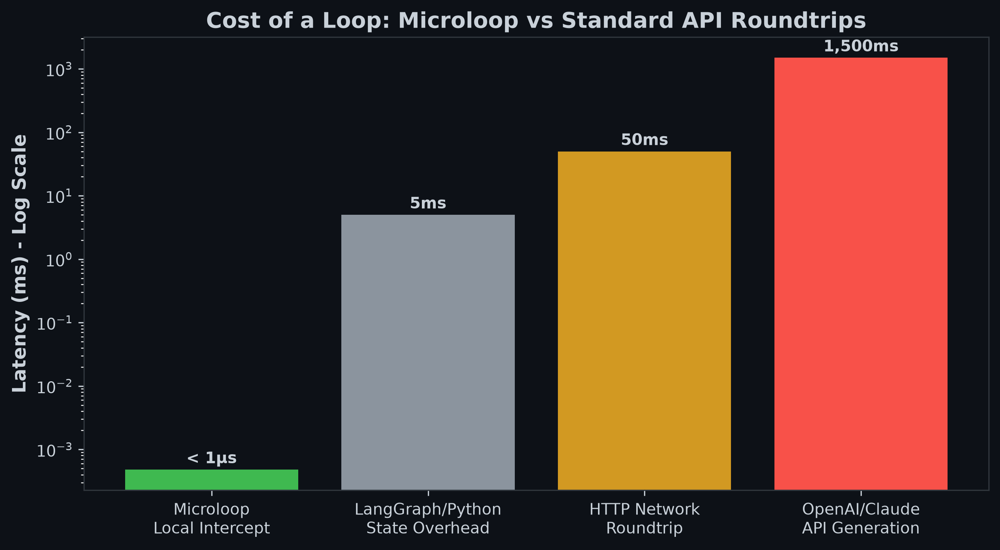

# Microloop

> **A zero-dependency drop-in infinite loop detector for autonomous coding agents.**


Microloop prevents autonomous AI agents from falling into infinite loops by intercepting redundant trajectories.

---

## 30-Second Quick Start

Microloop acts as a middleware. To use it as an upstream proxy in front of an LLM:

```bash
# 1. Start the proxy
cargo run --release --bin microloop-proxy

# 2. Point your agent to the proxy
export TARGET_API_URL="http://127.0.0.1:20128/v1"
```

---

## Architecture



### Demonstration
*(GIF Placeholder)*
<!--  -->

---

## Installation

Microloop is a C-compatible shared library `no_std` core.

### Rust
Add this to your `Cargo.toml`:
```toml
[dependencies]
microloop = "0.1.0"
```

### Python
Use the provided `ctypes` bindings:
```bash
pip install microloop-core
```
```python
import microloop
```

### Go
Use cgo bindings:
```go
import "github.com/tanmaydevare/microloop/go"
```

### C / C++
Link against `libmicroloop.so` and include `microloop.h`.
```c
#include "microloop.h"
```

---

## API Reference

### Core Methods

- `microloop_init(const char* config_json)`
  Initializes the state engine with the provided configuration.
- `microloop_verify(void* state, const char* context)`
  Verifies the current context. Returns `0` (Allow) or a specific error code (Block).
- `microloop_free(void* state)`
  Frees the state engine memory.

---

## Performance

The core trajectory hashing mechanism is designed to minimize overhead in the agent's critical path.



- **Overhead per step:** ~480ns
- **Memory Footprint:** < 10 MB overhead
- **Throughput:** > 2,000,000 requests/sec per thread

---

## The True Cost of a Loop

When an autonomous agent enters an infinite loop, it burns through time and API credits. 

If you attempt to catch these loops using standard LLM logic (like giving the agent a prompt to "think about your mistakes"), each iteration still requires an expensive API roundtrip, often taking **1.5+ seconds** and consuming tokens.

Microloop operates entirely locally. By intercepting redundant trajectories before they ever leave the machine, it blocks loops in **under 1 microsecond**. This transforms what would have been an expensive 1.5s API call into an instant, cost-free pivot.

---

## Roadmap

- [x] Basic hash-based loop detection
- [x] C-Bindings and `no_std` core
- [ ] Universal Gateway Support (OpenAI / Anthropic compat)
- [ ] Adaptive Thresholding
- [ ] WebAssembly target for browser-based agents

---

## FAQ

**Does Microloop block valid repetitive tasks?**
No. Microloop uses a sliding trajectory hash. If an agent performs the exact same sequence of failures and identical file states, it is blocked. Deliberate repetition (like processing an array row-by-row) generates distinct state deltas.

**Can I use this with any agent?**
Yes. Microloop is agnostic. It can be used via native bindings or as a simple reverse proxy on `localhost`.

---

## Security

If you discover a security vulnerability, please do NOT file a public issue. Refer to our [Security Policy](SECURITY.md) and email the maintainers directly. 

---

## License

This project is licensed under the MIT License - see the [LICENSE](LICENSE) file for details.
