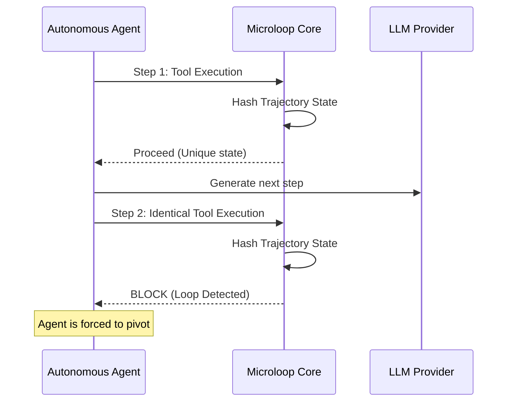

# Microloop

> A deterministic guardrail against runaway tool costs in AI agents.


AI agents get stuck in infinite tool loops. Each loop cycle burns API credits. Microloop detects redundant tool calls locally in **nanoseconds** and blocks them before the call ever leaves the machine.


---

## The Counter-Argument

**"Max iterations" is a budget, not a fix.**

| Approach | What happens |
|---|---|
| `max_iterations=10` | Kills a valid 15-step workflow at step 11. Lets a 2-step loop burn 8 more expensive API calls. |
| Microloop | Lets the valid workflow finish. Kills the loop at step 2 — the first repeat. |

Microloop is a **redundancy detector**, not a step counter. It gives agents infinite steps as long as they're making progress.

---

## Quick Start

```bash
cargo add microloop
cargo run --example basic
```

That's it. You'll see:

```
  Call 1: write_file → ALLOW
  Call 2: write_file → ALLOW
  Call 3: write_file → BLOCK
```

---

## Benchmarks

| Metric | Value |
|---|---|
| Overhead per check | ~480 ns |
| Memory footprint | < 10 MB |
| Throughput | > 2,000,000 checks/sec |
| Block latency | ~150 ns (loop pattern) |

Comparatively, detecting a loop via LLM prompt ("you are looping, please stop") takes **1.5+ seconds** and burns tokens. Microloop intercepts locally before the API call.

[Full benchmark results →](BENCHMARKS.md)

---

## Installation

### Rust

```toml
[dependencies]
microloop = "0.2.0"
```

### Python

```bash
pip install microloop
```

```python
from microloop import Microloop
engine = Microloop(config_yaml)
result = engine.verify("tool_name", '{"arg": "value"}')
```

### C / C++ / Go

Link against `libmicroloop.so` and include `microloop.h`. See the [C API reference](#c-api-reference).

---

## Architecture



Microloop sits between the agent and the LLM. Before each tool call leaves the machine, Microloop hashes the tool name and arguments against a sliding window of recent calls. Redundant trajectories are blocked instantly; unique ones pass through at full speed.

The core is `no_std` Rust with a C ABI. No Python runtime, no container, no external service — it links directly into your application.

---

## Known Limits

**Syntactic, not semantic (v0.1).** Microloop compares exact tool arguments. Two distinct actions that produce the same failure — `delete_line(5)` vs `comment_out(5)` — produce different hashes and won't be detected as a loop. Semantic comparison is available via the optional sidecar (see v0.3 features below).

**Semantic sidecar requires separate process.** The optional semantic loop detection uses an out-of-process sidecar with embedding models. This is opt-in and doesn't affect the core's latency or dependency profile.

**Proxy mode adds one moving part.** The reverse proxy is the simplest integration path for OpenAI-compatible agents. For direct integration, use the Rust crate or Python bindings instead.

---


## New in v0.2 (Now Available!)

**✅ Volatile Field Auto-Inference** — No more manual config! Microloop now automatically detects high-entropy fields (like `req_id`, `timestamp`) that change on every call and excludes them from loop detection. It validates across multiple prior calls to prevent false positives.

```yaml
# Before (manual config required)
tools:
  - name: search
    volatile_fields: ["req_id", "timestamp"]

# After (auto-inference enabled by default in proxy mode)
tools:
  - name: search
    # No volatile_fields needed - Microloop detects them automatically!
```

**✅ Adaptive Thresholding** — `max_repeats` is now dynamic. When errors are detected in the loop trajectory, Microloop reduces the tolerance to force faster pivoting:

- Normal mode: `max_repeats: 3` (allows 3 attempts)
- Error mode: Automatically reduces to `max_repeats: 2` (fail-fast)

**✅ Pluggable Blocklist Backend** — Semantic block rules now support Redis for multi-instance deployments:

```bash
# In-memory (default, single instance)
REDIS_URL=

# Redis (production, load-balanced)
REDIS_URL=redis://localhost:6379
```

---

## New in v0.3 (Experimental)

**✅ Semantic Loop Detection (Sidecar)** — Optional out-of-process sidecar that uses lightweight embeddings to catch semantic loops like `delete_line(5)` → `comment_out(5)` → `remove_line(5)`. The sidecar operates on the Fast Path / Slow Path architecture:

- **Fast Path (Core):** ~480 ns syntactic detection (unchanged)
- **Slow Path (Sidecar):** ~10-50 ms semantic analysis (async, non-blocking)

```bash
# Start the semantic sidecar (optional)
cargo run -p microloop-semantic

# Proxy automatically sends tool calls to sidecar for analysis
SIDECAR_URL=http://localhost:8081 cargo run -p microloop-proxy
```

**✅ Synchronous Sidecar Communication** — The proxy now makes synchronous HTTP calls to the sidecar, ensuring semantic block rules are applied before the LLM response is returned. No more race conditions!

---
## Roadmap

| Version | Focus |
|---|---|
| v0.1 | Syntactic loop detection, C ABI, proxy, PyO3 bindings |
| v0.2 | Volatile field auto-inference, adaptive thresholding |
| v0.3 | WASM target, opt-in semantic comparison (out-of-process) |

[Full roadmap →](ROADMAP.md)

---

## FAQ

**Does Microloop block valid repetitive tasks?**

No. Deliberate repetition (processing an array row-by-row) generates distinct state for each call. Microloop only blocks trajectories where the tool and arguments are identical within a configurable window. If your agent is doing the same thing and getting the same result, it's looping — and Microloop catches it.

**How is this different from `max_iterations`?**

A counter is blind. It kills the 15-step refactor at step 11 and lets the 2-step loop burn 8 more calls. Microloop detects *actual redundancy*, not step count. If the agent is making progress, Microloop never fires.

**Can I use this with any agent?**

Yes. Microloop is framework-agnostic — use it via the Rust crate, Python bindings, or the proxy. Works with LangChain, AutoGen, CrewAI, OpenAI, Anthropic, and any tool-calling agent.

**What about streaming?**

The proxy passes non-tool calls and streaming responses through transparently with zero parsing overhead.

---

## C API Reference

```c
// Initialize with YAML config
void* microloop_init(const char* yaml_str, size_t yaml_len);

// Verify a tool call. Returns 0 (allow) or non-zero (block).
uint8_t microloop_verify(void* state, const char* tool, size_t tool_len,
                         const char* args, size_t args_len);

// Get the last error message
const char* microloop_get_last_error(void* state);

// Free state
void microloop_free(void* state);
```

---

## Security

If you discover a security vulnerability, please do NOT file a public issue. Refer to our [Security Policy](SECURITY.md) and email the maintainers directly.

---

## License

MIT
