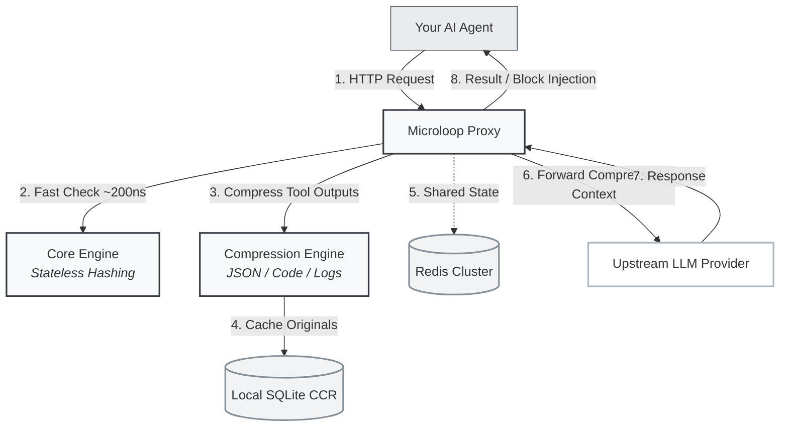

# Microloop

**The circuit breaker and context compressor for AI agents.**

[](LICENSE)
[](https://crates.io/crates/microloop)
[](https://pypi.org/project/microloop/)
[](https://pypi.org/project/microloop/)
[](https://github.com/Devaretanmay/microloop/actions)

**Rust · Python · WebAssembly · C/C++ · Go · Zero-Config Proxy**

<p align="center">
  
  <br>
  <em>See the full demo: <code>python3 scripts/demo_loop.py</code></em>
</p>

---

## The $500 Loop of Death

You build an autonomous agent, run it overnight, and wake up to a $500 OpenAI bill.

The agent tried to write a file or run a terminal command. The tool returned an error. The agent retried with the exact same arguments. It failed again. It spent the next six hours in a tight loop, burning millions of tokens and accomplishing nothing.

Worse, the tool outputs 50,000 tokens of raw JSON. The LLM gets buried in the noise, loses its reasoning thread, and loops harder.

Microloop stops the bleeding. It intercepts agent tool calls and LLM context. It blocks repetitive loops in under 200 nanoseconds and compresses bloated tool outputs by up to 95% before they ever reach the model.

---

## Blind Counters vs. Microloop

Traditional frameworks rely on step counters (`max_iterations = 10`). Step counters are blind to the actual execution state.

| The Blind Counter | The Microloop Shield |
| :--- | :--- |
| **Blocks valid workflows.** If a complex 15-step plan is working perfectly, a limit of 10 kills it. | **Unlocks infinite steps.** Your agent can run 100 steps if it is making unique progress. |
| **Allows expensive waste.** A 2-step loop will run 8 more times before hitting a limit of 10. | **Fails fast.** Blocks the loop at step 3—the very first redundant repeat. |
| **Ignores context bloat.** Passes 100k tokens of raw tool output to the LLM, causing confusion. | **Compresses context.** Reduces tool outputs by 60-95% while keeping the original data retrievable. |

Counters measure quantity. Microloop measures redundancy and information density.

---

## Core Architecture

### 1. Sub-Microsecond Fast Path
Microloop runs locally in-process. The pure Rust core hashes tool calls and checks the ring buffer for repetitive trajectories in under 200 nanoseconds. It introduces zero measurable overhead to your agent's execution.

### 2. Context Compression & CCR
Microloop intercepts `role: tool` outputs and routes them through specialized compression engines (JSON arrays, AST-based code, build logs, and prose). It reduces token count by 60-95%.
Original payloads are stored in a local SQLite Cache-Compress-Retrieve (CCR) store. If the LLM needs the dropped data, it calls a retrieval tool. The compression is lossy on the wire, but lossless end-to-end.

### 3. Amortized Trajectory Injection
When a loop is blocked, Microloop injects a dense summary of the agent's recent actions directly into the rejection message, forcing the LLM to see exactly why it is stuck and pivot.

### 4. Smart Volatile Field Masking
Automatically detects high-entropy fields (like `req_id: "9831"` changing to `req_id: "9832"`) and masks them, catching loops even when arguments are not 100% identical.

### 5. Adaptive Thresholding
If a tool call returns an error, the agent is in a high-risk state. Microloop automatically tightens its repetition thresholds on failure, forcing the agent to pivot immediately.

### 6. Horizontal Redis Sync
Plug in a Redis backend to share blocklists and loop states across your entire deployment in real-time.

---

## System Flow

Microloop can be used as a zero-code-change reverse proxy, a Python/JS middleware, or compiled directly into your native binary.



---

## Quick Start

### Option A: The Zero-Code-Change Proxy
Run the Microloop proxy and point your OpenAI or Anthropic client to it. No changes to your agent code required.

```bash
TARGET_API_URL=https://api.openai.com OPENAI_API_KEY=sk-... cargo run -p microloop-proxy

# In your agent code, change the base URL:
# openai.base_url = "http://127.0.0.1:8080/v1"
```

### Option B: Python SDK

```bash
pip install microloop
```

```python
from microloop import Microloop

engine = Microloop("max_repeats: 3")

result = engine.verify("write_file", '{"path": "/tmp/x.txt"}')
if result > 0:
    print("Action blocked. Trajectory summary injected.")

original_data = engine.retrieve("sha256_hash_of_original_payload")
```

### Option C: Rust SDK
```rust
use microloop::{MicroloopState, verify};

let mut state = MicroloopState::new("max_repeats: 3").unwrap();
let result = verify(&mut state, b"write_file", b"{\"path\": \"/tmp/x.txt\"}");
// result: 0 = Allow, >0 = Block
```

---

## Ecosystem Integrations

*   **LiteLLM**: Sub-microsecond Rust guardrails for LiteLLM proxies.
*   **LangGraph**: Middleware interceptors for LangGraph state machines.
*   **Model Context Protocol (MCP)**: Wrap every tool call in automatic loop detection and compression.

---

## Performance Benchmarks

All benchmarks run with `cargo run --release --bin microloop-benchmark` on a single thread.

| Metric | Microloop | Prompt-Based Guardrails |
| :--- | :--- | :--- |
| **Check Latency** | **197 nanoseconds** | ~1.5 seconds (API call) |
| **Context Reduction** | **60% - 95%** | 0% (Passes raw output) |
| **Operational Cost** | **$0.00** (Local execution) | ~$0.01 per step (Token burn) |
| **Execution Safety** | **100% Deterministic** | Probabilistic |
| **Memory Footprint** | **< 10 MB** | N/A |
| **Throughput** | **5,000,000+ checks/sec** | ~50 checks/sec |

| Benchmark | Iterations | Per Op | Ops/s |
| :--- | ---: | ---: | ---: |
| `verify_e2e` | 100,000 | **197 ns** | **5,071,573** |
| `cold_start_verify` | 10,000 | **42,460 ns** | **23,551** |
| `compress_short_fastpath` (<512 bytes) | 200,000 | **50 ns** | **19,905,780** |
| `oscillation_detect` | 500,000 | 3,049 ns | 327,887 |
| `state_init` | 10,000 | 43,176 ns | 23,160 |
| `compress_git_diff` | 50,000 | 6,811 ns | 146,821 |
| `compress_build_output` | 50,000 | 15,393 ns | 64,961 |
| `compress_json_array` | 50,000 | 33,993 ns | 29,417 |
| `compress_source_code` | 50,000 | 164,475 ns | 6,080 |
| `compress_search_results` | 50,000 | 198,066 ns | 5,049 |
| `mixed_workload` (verify + compress, 8 tools) | 10,000 | 1,094,099 ns | 914 |

```bash
cargo run --release --bin microloop-benchmark
```

---

## Configuration

```yaml
# Loop Detection
max_repeats: 3          # Max identical calls before blocking
history_window: 8       # Rolling window size to search for loops
strictness: Balanced    # Lenient, Balanced, or Strict

# Context Compression
compression:
  enabled: true
  ccr_enabled: true
  target_ratio: 0.8

tools:
  - name: execute_command
    trajectory_gate:
      volatile_fields: ["timestamp", "session_id"]
```

---

## Security

*   No tool data, code, or context ever leaves your environment.
*   Zero external API calls for loop detection or compression.
*   Apache 2.0 Licensed.

For security concerns, refer to [SECURITY.md](SECURITY.md).
