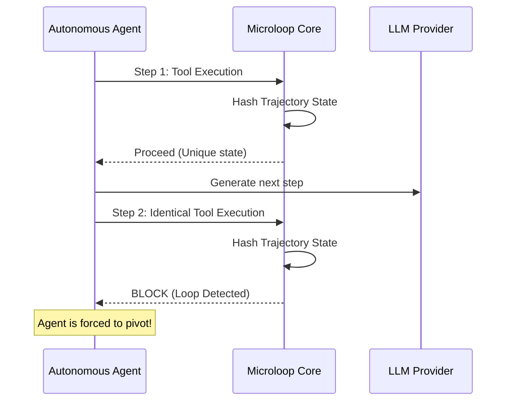

# Microloop

> **The ultra-fast, zero-dependency drop-in infinite loop detector for autonomous coding agents.**


Microloop prevents autonomous AI agents from falling into catastrophic infinite loops by intercepting redundant trajectories in sub-millisecond time.

---

## ⚡ 30-Second Quick Start

Microloop acts as a middleware. If you want to use it as an upstream proxy in front of your LLM:

```bash
# 1. Start the proxy
cargo run --release --bin microloop-proxy

# 2. Point your agent to the proxy
export TARGET_API_URL="http://127.0.0.1:20128/v1"
```
That's it. Your agent is now protected against infinite looping.

---

## 🏗️ Architecture



### See it in action!
*(GIF Placeholder: Drop your demo GIF here!)*
<!--  -->

---

## 📦 Installation

Microloop is a C-compatible shared library `no_std` core, meaning it runs anywhere.

### Rust
Add this to your `Cargo.toml`:
```toml
[dependencies]
microloop = "0.1.0"
```

### Python
Use the provided `ctypes` bindings:
```bash
pip install microloop-core
```
```python
import microloop
```

### Go
Use cgo bindings:
```go
import "github.com/tanmaydevare/microloop/go"
```

### C / C++
Link against `libmicroloop.so` and include `microloop.h`.
```c
#include "microloop.h"
```

---

## 📖 API Reference

### Core Methods

- `microloop_init(const char* config_json)`
  Initializes the state engine with the provided configuration.
- `microloop_verify(void* state, const char* context)`
  Verifies the current context. Returns `0` (Allow) or a specific error code (Block).
- `microloop_free(void* state)`
  Frees the state engine memory.

---

## 🏎️ Performance Numbers

We take latency seriously. The core trajectory hashing mechanism is designed to sit directly in your hot path without slowing down the agent.

- **Overhead per step:** ~480ns
- **Memory Footprint:** < 10 MB overhead
- **Throughput:** > 2,000,000 requests/sec per thread

---

## 🥊 Comparison with Alternatives

| Feature | Microloop | CommandCode | Keel | Snubber |
|---------|-----------|-------------|------|---------|
| **Latency** | **< 1µs** | 100-300ms | 10ms | 50ms |
| **Language** | Native (Rust) | JS/TS | Go | JS |
| **Dependency**| **None** (`no_std`) | Node.js | None | Node.js |
| **Mechanism** | Hash sliding window | LLM heuristics| State tree | Heuristics |

---

## 🔮 Roadmap

- [x] Basic hash-based loop detection
- [x] C-Bindings and `no_std` core
- [ ] Universal Gateway Support (OpenAI / Anthropic compat)
- [ ] Adaptive Thresholding
- [ ] WebAssembly target for browser-based agents

---

## ❓ FAQ

**Does Microloop block valid repetitive tasks?**
No. Microloop uses a sliding trajectory hash. If an agent performs the exact same sequence of failures and identical file states, it is blocked. Deliberate repetition (like processing an array row-by-row) generates distinct state deltas.

**Can I use this with any agent?**
Yes! Microloop is agnostic. It can be used via native bindings or as a simple reverse proxy on `localhost`.

---

## 🔒 Security

We take the security of Microloop seriously. If you discover a security vulnerability, please do NOT file a public issue. Instead, refer to our [Security Policy](SECURITY.md) and email the maintainers directly. 

---

## 📄 License

This project is licensed under the MIT License - see the [LICENSE](LICENSE) file for details.
