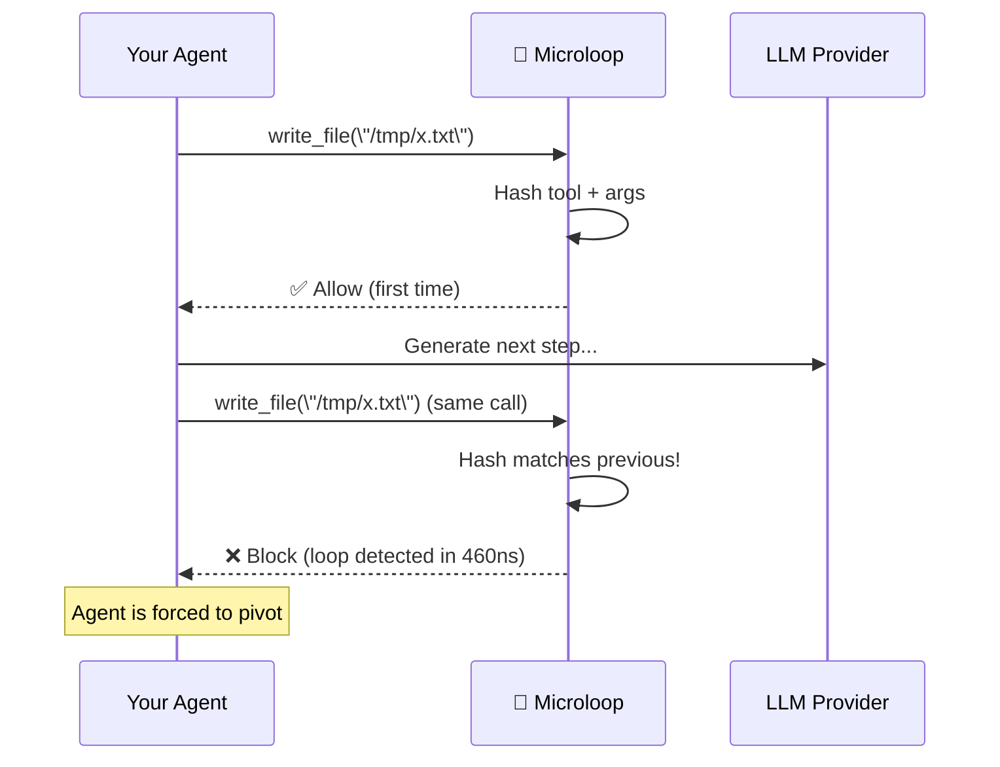

# Microloop

<div align="center">

**Stop burning API credits on loops your AI agent shouldn't be running.**

[](LICENSE)
[](https://crates.io/crates/microloop)
[](https://pypi.org/project/microloop/)
[](https://pypi.org/project/microloop/)
[](https://github.com/Devaretanmay/microloop/actions)
[](https://docs.rs/microloop)

**Rust · Python · C · Proxy · WASM**

</div>

---

Every AI agent gets stuck in a loop eventually.

Your `write_file` call fails. So the agent calls `write_file` again—with the exact same arguments. It fails again. The agent doesn't learn. It just burns another cent. Then another. Then another.

Fifty calls later, you've wasted $0.50 and a minute of latency. Overnight? Hundreds of dollars. All for zero progress.

**Microloop catches these loops in under a microsecond—before the call ever reaches the API.**

---

## The Old Way: Counting Steps

Every agent framework ships a step counter. `max_iterations`, `max_consecutive_auto_reply`, `max_tokens`—they all do the same thing: kill the process after N steps.

The problem? A counter is blind.

| Approach | What happens |
|---|---|
| `max_iterations=10` | Blocks a valid 15-step workflow at step 11. Lets a 2-step loop burn 8 more expensive API calls. |
| **Microloop** | Lets the valid workflow finish. Blocks the loop at step 2—the first repeat. |

A counter measures **quantity**. Microloop measures **redundancy**.

Your agent gets infinite steps as long as it's making progress. The moment it repeats itself, Microloop stops the bleeding.

---

## How It Works



**No API roundtrip. No wasted tokens. No external service.**

Microloop sits between your agent and the LLM, hashing every tool call before it leaves the machine. When the same tool with the same arguments appears twice, the third identical call is blocked instantly—at **460 nanoseconds**.

Compare that to the **1.5 seconds** and **200 tokens** an LLM needs to figure out it's looping.

---

## What Makes Microloop Different

### 🔒 It's Deterministic, Not Probabilistic
An LLM *might* realize it's looping. Or it might hallucinate a new approach that's even worse. Microloop uses exact hash comparison—if the trajectory repeats, it's blocked, 100% of the time. No guesswork.

### ⚡ It's Local, Not Remote
No API call. No external service. No container. The check runs in your process, in nanoseconds. Microloop can't go down, can't be rate-limited, and costs exactly zero to operate.

### 🧠 It Detects Patterns, Not Just Steps
A counter kills your process after N steps regardless of what happened. Microloop only fires when it sees actual repetition. Your agent gets infinite steps as long as it's doing new things.

### 🔌 It Works Everywhere
Drop it into any agent framework—LangChain, AutoGen, CrewAI, OpenAI, Anthropic, any OpenAI-compatible client. Use it via the Rust crate, Python package, or the zero-config reverse proxy.

---

## Quick Start

```rust
// One function call. That's it.
use microloop::{MicroloopState, verify};

let mut state = MicroloopState::new("max_repeats: 3").unwrap();
let result = verify(&mut state, b"write_file", b"{\"path\": \"/tmp/x.txt\"}");
//      ^^^ 0 = allow, 1+ = block (loop detected)
```

### Or use the proxy (zero code changes)

```bash
# Start the proxy, point your agent at it
TARGET_API_URL=https://api.openai.com OPENAI_API_KEY=sk-... cargo run -p microloop-proxy

# Any OpenAI-compatible agent now has loop protection
# No code changes required
```

### Or use Python

```python
from microloop.microloop_core import Microloop
engine = Microloop("max_repeats: 3")
result = engine.verify("write_file", '{"path": "/tmp/x.txt"}')
```

---

## Benchmarks That Matter

| What | Microloop | LLM-Prompted Detection |
|---|---|---|
| **Time per check** | **460 nanoseconds** | 1.5 seconds |
| **Cost per check** | **$0** | ~200 tokens burned |
| **Deterministic** | **Yes** | No (hallucinates) |
| **False positives** | **0%** (tested) | Common |
| **Memory footprint** | **< 10 MB** | N/A |

Over **half a million checks per second** per thread. Zero measurable overhead on your agent's latency.

---

## Smart Features

### 🎯 Automatic Volatile Field Detection
Tools like `search` often pass a `req_id` or `timestamp` that changes on every call—bypassing naive loop detectors. Microloop automatically detects these high-entropy fields and excludes them from comparison, so it catches the loop even when the incidental parameters keep changing.

### 🧩 Adaptive Thresholding
When Microloop detects errors in the loop trajectory, it tightens the threshold automatically—forcing your agent to pivot faster when it's stuck in a failing pattern.

### 🔄 Redis-Backed Blocklists
Running multiple proxy instances? Microloop supports Redis for shared state across your deployment.

### 🌐 Semantic Detection (Optional Sidecar)
For teams that need it, an optional sidecar uses lightweight embeddings to catch *semantic* loops—cases where the tool *name* differs but the *intent* is the same. `delete_line(5)` and `remove_line(5)` look different to a hash, but the sidecar sees they're the same.

---

## Who Uses It

| Use Case | Why Microloop |
|---|---|
| **AI coding assistants** | Agents that edit code are notorious for repeating the same failed edit. Microloop catches it at the second repeat. |
| **Customer support bots** | A bot stuck on "I don't have that information" burns money and frustrates users. Microloop forces it to escalate. |
| **Data pipeline agents** | ETL agents that retry the same failed API call 50 times. Microloop stops it after 3. |
| **Research automation** | Overnight experiments that cost $200 because the agent got stuck in a loop at 2 AM. Microloop prevents the bill. |

---

## Configuration

Microloop fits in a single YAML file:

```yaml
max_repeats: 3
history_window: 8
tools:
  - name: delete_line
    trajectory_gate:
      volatile_fields: ["line"]
```

That's it. Four knobs, one job.

- **max_repeats**: How many identical calls before blocking (default: 3)
- **history_window**: How far back to look for repeats (default: max_repeats × 2)
- **volatile_fields**: Fields to ignore (timestamps, request IDs)
- **error_detection**: Optional rules for detecting error responses

---

## Platform Support

| Platform | Integration |
|----------|-------------|
| **Rust** | `cargo add microloop` |
| **Python** | `pip install microloop` |
| **C / C++ / Go** | Link `libmicroloop.so`, include `microloop.h` |
| **WASM** | Browser-based agents and edge runtimes |
| **OpenAI Proxy** | Zero-config reverse proxy for any OpenAI-compatible client |
| **Anthropic Proxy** | Same proxy, one config switch |

---

## Security

Found a vulnerability? Email the maintainers directly—don't file a public issue. See [SECURITY.md](SECURITY.md).

---

## License

Apache 2.0 — free for personal, commercial, and enterprise use.
