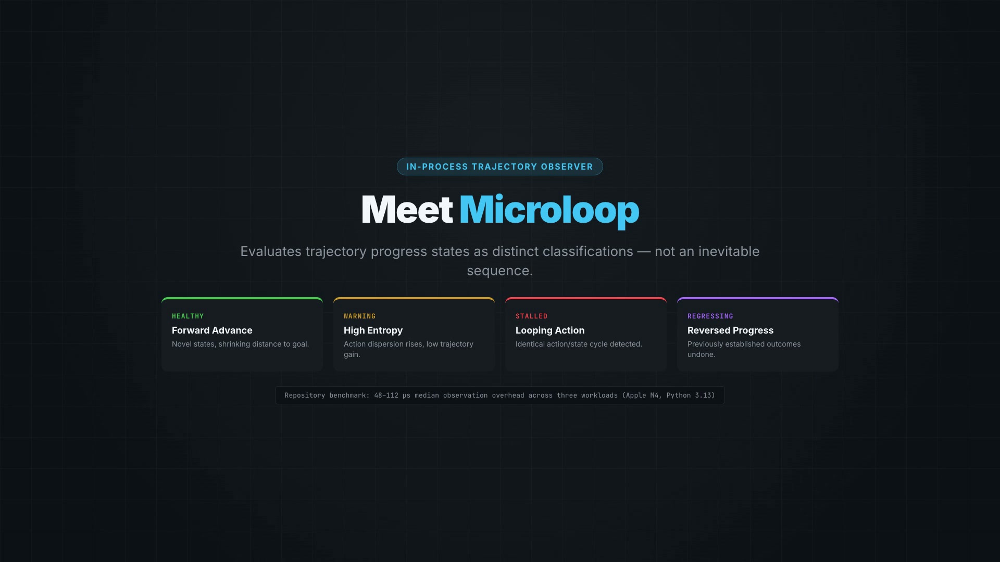

# Microloop

**Behavior JIT for production AI.**

[](docs/assets/microloop_launch_film_45s.mp4)

Microloop learns which repeated AI behavior no longer needs inference. It observes bounded AI decisions and their real outcomes. Once a decision pattern has enough independent evidence, it executes locally. Novel or uncertain states continue to the existing model, and stale behavior is automatically revoked.

```text
observe → compile → shadow → qualify → active → deopt (on drift)
```

---

## What problem does this solve?

Production AI agents make the same bounded decisions repeatedly — routing tickets, selecting tools, classifying intent. Each call costs money and adds latency, even when the answer hasn't changed.

Microloop identifies these repeated decisions, proves they're correct against real outcomes, and serves them locally in under 0.2ms. When reality changes, it detects drift and falls back to the model automatically.

## What does it NOT optimize?

- Free-form text generation
- Creative or exploratory tasks
- Decisions that can't be independently verified
- Workloads with very low repetition
- High-entropy research or planning

If your workload doesn't have bounded, repeating, verifiable decisions, Microloop will tell you. That's a feature.

---

## Quickstart

```bash
pip install microloop
```

### Evaluate before integrating

Analyze your existing traces without changing production code:

```bash
microloop discover traces.jsonl
```

```text
Found 8 model decision sites

Strong candidates
  support.route      repeat=72%  entropy=1.8  choices=3  verifier=available
  agent.tool_select  repeat=58%  entropy=2.1  choices=4  verifier=available

Needs more data
  fraud.escalation   repeat=31%  entropy=2.5  choices=3  traces=47

Not recommended
  response.generate  HIGH ENTROPY (6.2 bits) — open-ended generation
  research.plan      LOW REPETITION (8%) — mostly unique states
```

### Integrate in ~15 lines

```python
from microloop import DecisionSite, Microloop, FallbackResult

site = DecisionSite(
    name="support.route",
    state_schema={"text": "string", "amount": "integer"},
    choices=("refund", "request_info", "specialist"),
)

with Microloop() as loop:
    # Decide: serves locally when qualified, else calls your model
    result = loop.decide(
        site=site,
        state={"text": "Item damaged in shipping", "amount": 25},
        fallback=lambda: FallbackResult(my_llm_call(), cost=0.002, model_calls=1),
    )

    # Execute the action
    receipt = execute_action(result.choice)

    # Record the real outcome — this is how Microloop qualifies decisions
    loop.record_outcome(
        result.decision_id,
        quality=1.0 if receipt.success else 0.0,
        verifier="fulfillment_system",
        verifier_version="1",
        evidence={"order_id": receipt.order_id},
    )
```

---

## What happens if Microloop is uncertain?

It calls your model. Microloop never serves a decision it hasn't qualified through independent outcome verification. The `fallback` function runs normally — your agent behaves exactly as it did before Microloop.

---

## Measured Results

From the [competitive benchmark](benchmarks/results/competitive_frontier/REPORT.md) — 18,000 decisions across 4 workloads with strict 70/30 temporal evaluation:

| Metric | Measured Value | Scope |
| :--- | :--- | :--- |
| Local fast-path latency | 0.18–0.19 ms (p50) | Qualified local serves only |
| DecisionSite call reduction | 19.9–40.4% | Within bounded decision sites |
| Whole-app call reduction | 3.99–10.10% | Entire application (sites = 15–25% of traffic) |
| Whole-app spend reduction | 3.51–8.87% | Entire application |
| Wrong serves before demotion | 7–8 | Under injected passive policy drift |
| Static cache wrong-serve rate | 12.0–18.0% | Same drift conditions |
| High-entropy workload | Correctly rejected | Refused compilation (0% wasted resources) |

> **Important denominators:** Bounded verifiable decisions typically represent 15–25% of total application LLM calls. Whole-application savings reflect this. Do not extrapolate DecisionSite-level numbers to entire applications.

### What Microloop does NOT claim

- Zero errors — Microloop incurred 7–8 wrong serves before detecting drift and demoting
- 80% company-wide cost reduction — whole-app savings depend on bounded traffic share
- Replacement of all model calls — only bounded, repeating, verifiable decisions qualify
- Faster entire applications — 0.18ms applies to qualified local serves, not total workflow

---

## How it works

```text
1. OBSERVE    Your agent runs normally. Microloop records decisions and outcomes.
2. PROFILE    Microloop estimates repetition, entropy, and qualification cost.
3. COMPILE    High-value sites get a local candidate fast path.
4. SHADOW     The candidate runs alongside the model. Outcomes are compared.
5. QUALIFY     Statistical tests confirm the fast path matches model quality.
6. ACTIVE     Qualified decisions serve locally in <0.2ms.
7. COMPARE    Ongoing comparison traffic (5–10%) monitors for drift.
8. DEOPT      If quality degrades, Microloop revokes the fast path automatically.
```

---

## When to use Microloop

- **Repetitive bounded decisions** — routing, triage, tool selection, classification with repeat rate ≥ 20%
- **Measurable outcome feedback** — a downstream system can verify whether the decision was correct
- **High model latency or cost** — remote LLM calls ≥ 100ms or meaningful per-call cost
- **Policy drift matters** — you need stale decisions detected and revoked automatically

## When NOT to use Microloop

- **Free-form generation** — open-ended text, creative writing, high-entropy outputs
- **Non-repetitive tasks** — research, web navigation with unique URLs, one-off analysis
- **No verifier signal** — decisions where correctness can't be independently evaluated
- **Very low volume** — fewer than a few hundred decisions per site

---

## CLI

```bash
microloop discover traces.jsonl          # Analyze traces for compilable sites
microloop sites --db decisions.db        # List registered decision sites
microloop sites --db decisions.db --json # Machine-readable site status
```

## Documentation

- [Architecture](docs/architecture.md) — how the Decision JIT works internally
- [Concepts](docs/concepts.md) — DecisionSites, Fast Paths, Deopt, verification
- [CLI Reference](docs/cli.md) — command-line interface
- [Integration Guide](docs/integration.md) — connecting Microloop to your agent
- [Claims Registry](docs/claims.md) — every claim with its evidence and scope
- [Production Safety](docs/production-safety.md) — qualification lifecycle, drift detection, failure modes
- [Security & Data Handling](docs/security.md) — what's stored, what leaves the machine
- [Vision](docs/vision.md) — future direction

## Tests

```bash
pytest python/microloop/tests/
```

105 tests covering the full qualification lifecycle, drift detection, fleet operation, and safety invariants.

---

License: Apache-2.0
